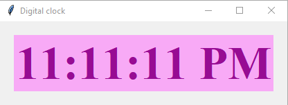

## Description
The Digital Clock program is a Python application built with Tkinter, a GUI library, to display and update the current time in a digital format. It showcases a user-friendly interface with a bold and clear display of the time in HH:MM:SS AM/PM format. The clock updates automatically every second, providing an accurate representation of the current time. This program serves as an illustrative example for creating basic GUI-based applications in Python.

## Screenshot

